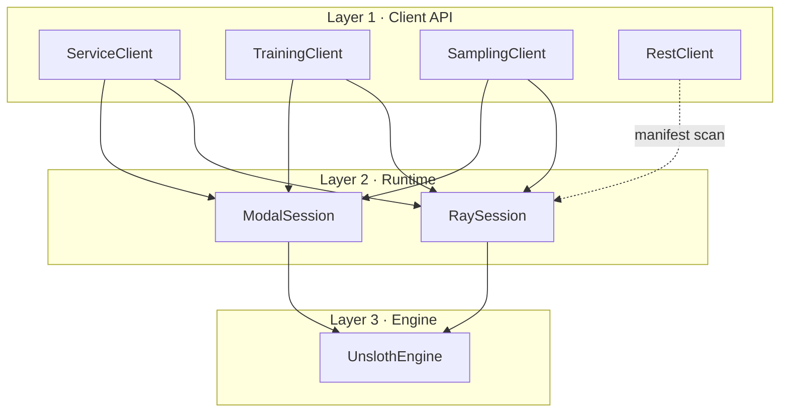
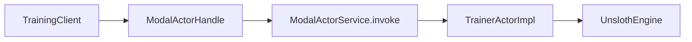
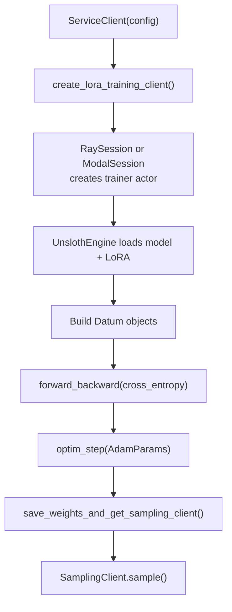
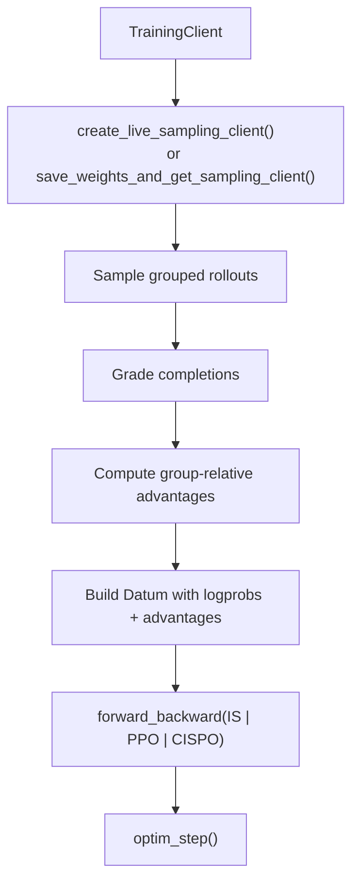
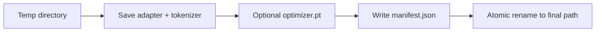
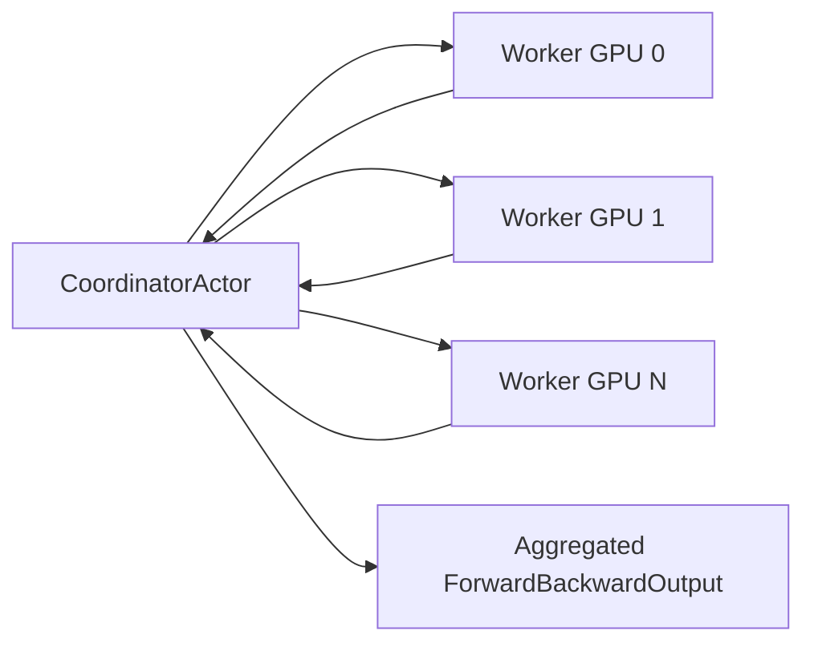

# Architecture

Three layers: a **Tinker-shaped client API**, a **Ray/Modal runtime**, and a **Unsloth GPU engine**. Your Python loop calls the clients; the clients route to actors; the actors run Unsloth.

<div class="doc-callout doc-callout--tip">

New here? Run the [Quickstart](./quickstart.md) first, then come back for the full picture.

</div>

## System overview



## Layer 1: public client API

The client API lives in `src/ray_unsloth/clients`:

- `ServiceClient` creates training clients, sampling clients, checkpoint inspection clients, and selects Ray or Modal runtime.
- `TrainingClient` forwards Tinker-style training methods to a trainer actor.
- `SamplingClient` forwards generation and logprob methods to one or more sampler actors, round-robin across replicas.
- `RestClient` provides a local manifest-backed subset of checkpoint and training-run inspection APIs.

Every actor call returns a small future wrapper:

- `ImmediateFuture` wraps synchronous local values.
- `RayObjectFuture` wraps Ray object refs.
- `AsyncMethodFuture` bridges async method forms.
- `FutureValueProxy` lets synchronous values still work with older `.result()` call sites.

## Layer 2: runtime sessions

Runtime selection happens in `ServiceClient.__init__`:

```python
self._session = ModalSession(self.config) if self.config.modal.enabled else RaySession(self.config)
```

### RaySession

`RaySession` creates Ray actors directly:

- `TrainerActor` for one trainable Unsloth model.
- `SamplerActor` for inference-only replicas.
- `DistributedTrainerWorkerActor` plus `DistributedTrainerCoordinatorActor` when `distributed.enabled` is true.

It also creates per-session placement groups so independent trainer or sampler sessions do not share a single global bundle reservation.

### ModalSession

`ModalSession` keeps the Python control plane local but executes actor methods inside Modal GPU containers. It builds a Modal image with the package source mounted into `/root/ray_unsloth_src`, installs torch/transformers/unsloth packages based on the selected model and speed settings, and stores in-container actor instances in a registry keyed by actor kind, session id, and replica index.

The result is a Ray-like local handle:



This lets user code keep the same client calls while the heavy GPU work happens remotely.

## Layer 3: UnslothEngine

`UnslothEngine` lives in `src/ray_unsloth/runtime/unsloth/engine.py`. It owns:

- Model and tokenizer loading through `FastLanguageModel.from_pretrained`.
- LoRA injection through `FastLanguageModel.get_peft_model`.
- Optimizer creation and updates.
- Forward-only loss computation.
- Forward/backward loss computation.
- Generation with `generate`/`fast_generate` fallback to a manual forward loop.
- Prompt and completion logprob computation.
- Adapter checkpoint save/load.
- Optional distributed initialization and DDP wrapping.

## End-to-end SFT flow



## End-to-end RL flow



The RL examples use the same low-level primitives as SFT. The difference is the `Datum.loss_fn_inputs` payload and selected loss function.

## Checkpoint architecture

Checkpoint helpers live in `src/ray_unsloth/checkpoints.py`. Saves are published atomically:



Supported path forms:

- Plain relative names under `checkpoint_root/session_id`.
- Absolute or path-like local paths.
- `local://...`.
- `tinker://local/...`.
- Other `tinker://...` values are mapped into `checkpoints/tinker/...` for local compatibility.

## Distributed training architecture

Distributed mode is deliberately narrow. It supports single-node DDP:

- `distributed.mode` must be `ddp`.
- `distributed.num_nodes` must be `1`.
- `distributed.gpus_per_node` must be at least `1`.

`RaySession` creates one Ray worker per GPU and a CPU coordinator. The coordinator shards input datums round-robin, calls every worker, aggregates losses and metrics, and returns a response with original datum order restored for `loss_fn_outputs`.



## Important design tradeoffs

- The project favors low-level control over a high-level trainer abstraction.
- The public surface mirrors Tinker where useful, but the backend is local/Ray/Modal rather than hosted.
- The type system uses dataclasses for pickling and Ray friendliness rather than Pydantic models.
- Sampler clients can point at separate sampler actors or at the live training actor.
- The current checkpoint backend is filesystem/Modal-Volume oriented, not an object-store service.
