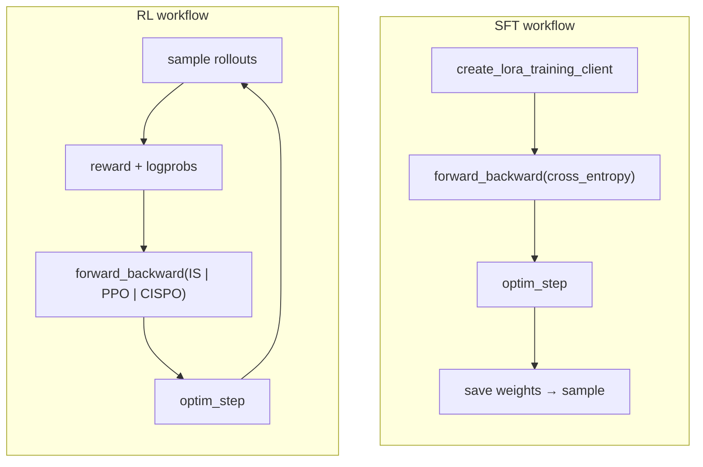

# Tinker API Compatibility

This page tracks **training-relevant** parity between [the public Tinker SDK](https://tinker-docs.thinkingmachines.ai/tinker/quickstart/) and `ray-unsloth`.

`ray-unsloth` mirrors Tinker's low-level client shape — `ServiceClient`, `TrainingClient`, `SamplingClient`, checkpoint helpers — but runs on **Ray + Unsloth + optional Modal**, not the hosted Tinker service.

**Out of scope for this matrix:** authentication, billing, project management, audit logs, remote session APIs, and hosted-only storage URLs. Those are Tinker control-plane concerns and are intentionally not part of this project.

## Status legend

| Badge | Meaning |
| --- | --- |
| Implemented | Works end-to-end for local/Modal runs |
| Partial | Present but missing params, local-only behavior, or sync alias |
| Not yet | Not implemented; may be planned |
| Extension | ray-unsloth addition beyond Tinker |

## Summary

  
<strong>42</strong>Implemented

  
<strong>14</strong>Partial

  
<strong>18</strong>Not yet

  
<strong>8</strong>Extensions

Core training workflows from the [Tinker quickstart](https://tinker-docs.thinkingmachines.ai/tinker/quickstart/) are supported:

---

## ServiceClient

Reference: [tinker.ServiceClient](https://tinker-docs.thinkingmachines.ai/tinker/api-reference/serviceclient/)

| Method | Status | Notes |
| --- | --- | --- |
| `create_lora_training_client(...)` | Implemented | `base_model`, `rank`, `seed`, target-module flags, metadata |
| `create_training_client_from_state(path)` | Implemented | Loads adapter without optimizer |
| `create_training_client_from_state_with_optimizer(path)` | Implemented | Loads adapter + optimizer |
| `create_sampling_client(model_path, base_model, ...)` | Partial | Works; `retry_config` and extra kwargs ignored |
| `create_rest_client()` | Implemented | Returns local manifest scanner, not HTTP server |
| `get_server_capabilities()` | Partial | Reflects local config/models; `features["losses"]` under-reports RL losses |
| `create_lora_training_client_async(...)` | Partial | Sync alias, not remote async RPC |
| `create_sampling_client_async(...)` | Partial | Sync alias |
| `create_training_client_from_state_async(...)` | Partial | Sync alias |
| `create_training_client_from_state_with_optimizer_async(...)` | Partial | Sync alias |
| `get_server_capabilities_async()` | Partial | Sync alias |
| `get_registered_renderer_names()` | Not yet | Tinker renderer registry |
| `get_renderer(name)` | Not yet | |
| `get_registered_tokenizer_names()` | Not yet | |
| `get_tokenizer(name)` | Not yet | Tokenizer access is on Training/Sampling clients |
| `get_recommended_renderer_name(s)` | Not yet | |
| `get_model_attributes(model)` | Not yet | |
| `get_lora_param_count(...)` | Not yet | Model introspection helpers |
| `get_lora_lr_multiplier(...)` | Not yet | |
| `get_lora_lr_over_full_finetune_lr(...)` | Not yet | |
| `get_full_finetune_param_count(...)` | Not yet | |
| `get_full_finetune_lr_multiplier(...)` | Not yet | |
| `get_lr(...)` | Not yet | |
| `get_last_checkpoint(...)` | Not yet | |
| `close()` | Extension | Tear down Ray/Modal session |
| `attach_sampler_download_url(response)` | Extension | Modal/local LoRA download URLs |

**Entry-point difference:** Tinker uses `ServiceClient()` with hosted credentials. `ray-unsloth` requires `ServiceClient(config="configs/example.yaml")` (YAML, dict, or `RuntimeConfig`).

---

## TrainingClient

Reference: [tinker.TrainingClient](https://tinker-docs.thinkingmachines.ai/tinker/api-reference/trainingclient/)

| Method | Status | Notes |
| --- | --- | --- |
| `get_info()` | Implemented | Returns `TrainingClientInfo` |
| `get_tokenizer()` | Implemented | Future-like `.result()` wrapper |
| `forward(data, loss_fn)` | Implemented | No-grad forward |
| `forward_backward(data, loss_fn, loss_fn_config)` | Implemented | Built-in + registered custom losses |
| `forward_backward_custom(data, loss_fn, loss_fn_config)` | Implemented | Callable or registered name |
| `optim_step(AdamParams(...))` | Implemented | AdamW + grad clipping |
| `save_state(path)` | Implemented | Adapter checkpoint; `ttl_seconds` ignored |
| `load_state(path)` | Implemented | |
| `load_state_with_optimizer(path)` | Implemented | |
| `save_weights_for_sampler(path)` | Implemented | Sampler-ready adapter weights |
| `save_weights_and_get_sampling_client(...)` | Implemented | Live actor for 1 replica; saves first for N>1 |
| `create_sampling_client(model_path)` | Implemented | Delegates to `ServiceClient` |
| `forward_async(...)` | Implemented | True async submission |
| `forward_backward_async(...)` | Implemented | |
| `forward_backward_custom_async(...)` | Implemented | |
| `optim_step_async(...)` | Implemented | |
| `save_state_async(...)` | Implemented | |
| `load_state_async(...)` | Implemented | |
| `load_state_with_optimizer_async(...)` | Implemented | |
| `save_weights_for_sampler_async(...)` | Implemented | |
| `save_weights_and_get_sampling_client_async(...)` | Implemented | True async |
| `get_info_async()` | Not yet | |
| `create_sampling_client_async(...)` | Partial | Sync alias |
| `register_custom_loss(name, fn)` | Extension | Named custom loss registry |
| `save_state_with_optimizer(...)` | Extension | Explicit optimizer checkpoint method |
| `save_sampler_with_download_url(...)` | Extension | Signed LoRA tarball export |
| `create_live_sampling_client(...)` | Extension | On-policy sampling without checkpoint round-trip |
| `compute_logprobs(prompt)` | Extension | On training actor (Tinker exposes on SamplingClient) |

---

## SamplingClient

Reference: [tinker.SamplingClient](https://tinker-docs.thinkingmachines.ai/tinker/api-reference/samplingclient/)

| Method | Status | Notes |
| --- | --- | --- |
| `sample(prompt, num_samples, sampling_params, ...)` | Implemented | Stop trimming, seeds, prompt/generated logprobs |
| `compute_logprobs(prompt)` | Implemented | Prompt token logprobs |
| `get_tokenizer()` | Implemented | Modal loads tokenizer locally to avoid actor deserialization |
| `get_base_model()` | Implemented | |
| `sample_async(...)` | Implemented | Returns resolved response |
| `compute_logprobs_async(...)` | Implemented | |
| `get_base_model_async()` | Partial | Wraps sync call |
| `SamplingClient.create(...)` | Not yet | Classmethod factory |
| `on_queue_state_change(callback)` | Not yet | Hosted queue hooks |
| Pickle / cross-process handoff | Not yet | Tinker clients are picklable for multiprocessing |

**Topology:** `ray-unsloth` supports independent sampler replicas (round-robin), saved-weight samplers, and live-policy sampling from the training actor.

---

## RestClient (checkpoint inspection)

Reference: [tinker.RestClient](https://tinker-docs.thinkingmachines.ai/tinker/api-reference/restclient/)

Only checkpoint and weight-inspection methods relevant to local training are listed. Hosted control-plane endpoints are omitted.

| Method | Status | Notes |
| --- | --- | --- |
| `list_training_runs()` | Partial | Groups local manifests by session id |
| `get_training_run(training_run_id)` | Partial | Local filesystem only |
| `list_checkpoints(training_run_id)` | Partial | Scans `checkpoint_root`; no cursor pagination |
| `get_weights_info(path)` | Partial | Reads local manifest |
| `publish_checkpoint_from_tinker_path(path)` | Partial | Sets `published=True` in local manifest only |
| `get_training_run_by_tinker_path(path)` | Not yet | |
| `get_weights_info_by_tinker_path(path)` | Not yet | |
| `get_checkpoint_archive_url(...)` | Not yet | Hosted archive URLs |
| `get_checkpoint_archive_url_from_tinker_path(...)` | Not yet | |
| `delete_checkpoint(...)` | Not yet | |
| `delete_checkpoint_from_tinker_path(...)` | Not yet | |
| `unpublish_checkpoint_from_tinker_path(...)` | Not yet | |
| `set_checkpoint_ttl_from_tinker_path(...)` | Not yet | TTL accepted on save but not enforced |
| `list_user_checkpoints(...)` | Not yet | |
| `get_sampler(sampler_id)` | Not yet | |

---

## Loss functions

Reference: [Tinker losses](https://tinker-docs.thinkingmachines.ai/tinker/losses/)

| Loss | Status | `loss_fn_inputs` | Notes |
| --- | --- | --- | --- |
| `cross_entropy` | Implemented | `target_tokens`/`labels`, optional `weights` | SFT |
| `importance_sampling` | Implemented | `target_tokens`, `logprobs`, `advantages`, optional `weights` | RL |
| `ppo` | Implemented | Same as IS | `clip_low_threshold`, `clip_high_threshold` in config |
| `cispo` | Implemented | Same as IS | Clip thresholds in config |
| `custom` (callable) | Implemented | User-defined | Via `forward_backward_custom` |
| `dro` | Not yet | — | Listed in Tinker SDK |
| GRPO | Not yet | — | Roadmap |
| DPO / preference objectives | Not yet | — | Roadmap |
| Reward-model-driven losses | Not yet | — | Roadmap |

---

## Data types

| Type | Status | Notes |
| --- | --- | --- |
| `ModelInput` | Implemented | Chunks, `from_ints`, `to_ints`, append |
| `EncodedTextChunk` | Implemented | |
| `Datum` | Implemented | Auto-converts nested tensors |
| `TensorData` | Implemented | NumPy/Torch conversion |
| `SamplingParams` | Implemented | `max_tokens`, temperature, top-p/k, stop, seed, logprob limits |
| `AdamParams` | Implemented | `beta1`/`beta2`/`grad_clip_norm` aliases |
| `SampleResponse` / `GeneratedSequence` | Implemented | Text, tokens, logprobs, finish reason |
| `ForwardBackwardOutput` / `OptimStepResult` | Implemented | |
| `Checkpoint` / `TrainingRun` / capabilities types | Implemented | Local dataclass equivalents |
| `ImageChunk` / `ImageAssetPointerChunk` | Partial | Type-compatible placeholders; engine is text/token focused |
| HTTP request types (`ForwardRequest`, etc.) | Not yet | Not needed for in-process client API |
| `Cursor` pagination type | Not yet | Type exists; RestClient doesn't paginate |
| `SamplerDownloadResponse` | Extension | Modal download metadata |

Types use **dataclasses** (pickle/Ray friendly) rather than Pydantic models.

---

## Compatibility alias

| Symbol | Status | Notes |
| --- | --- | --- |
| `import tinker` | Implemented | Re-exports `ray_unsloth` clients and types |
| `tinker.types.*` submodule shims | Implemented | Cookbook import paths |
| Exception shims (`TinkerError`, etc.) | Implemented | |

---

## Behavioral differences

### Configuration

Hosted Tinker provisions remote GPUs from credentials. `ray-unsloth` reads a **runtime config** (Ray resources, Modal image, model aliases, checkpoint root, LoRA defaults).

### Futures

Tinker returns hosted `APIFuture` objects. `ray-unsloth` wraps Ray object refs or immediate values in local future proxies with `.result()`, `.get()`, and selective async support.

### Checkpoints

Tinker uses hosted `tinker://` storage. `ray-unsloth` writes atomic adapter directories with `manifest.json` to local paths or Modal Volumes. `tinker://local/...` and mapped `tinker://...` paths are supported for compatibility.

### Cookbook abstractions

The [Tinker Cookbook](https://github.com/thinking-machines-lab/tinker-cookbook) provides pipelines, evaluators, dataset loaders, and CLI recipes. **This repo does not reimplement those.** It provides low-level primitives and examples that follow similar algorithmic shapes (`tinker_first_sft_training`, `tinker_first_rl_training`, math RL, RULER, multi-tenant).

---

## When to use which

| Use **Tinker** when… | Use **ray-unsloth** when… |
| --- | --- |
| You want the hosted GPU service | You want Ray/Modal/Unsloth control |
| You need the full model catalog and renderer registry | You configure models via YAML + Unsloth |
| You want managed `tinker://` checkpoint storage | You want local or Modal Volume checkpoints |
| You rely on Cookbook pipelines out of the box | You write the loop and use examples as templates |

---

## Planned parity work

See [Roadmap](./project/roadmap.md) for details. Highest-impact gaps:

1. **`dro` loss** and broader RL objective coverage
2. **ServiceClient model introspection** helpers (`get_lora_param_count`, renderer registry)
3. **RestClient** archive URLs, delete/TTL, and `tinker://` path helpers
4. **Capability reporting** — advertise implemented RL losses in `get_server_capabilities()`
5. **True async** on ServiceClient factory methods
6. **Vision/multimodal** — move image chunks from placeholders to engine support
