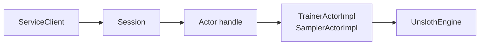

# Extending ray-unsloth

The codebase is intentionally small enough to extend directly, and every
extensible surface is a **typed registry** in `ray_unsloth.plugins`:

| Registry | Contents |
| --- | --- |
| `providers` | runtime providers (`local-ray`, `modal`, `fake`, `skypilot`, ...) |
| `losses` | `LossSpec` entries dispatched by the engine |
| `scorers` | eval scorers (`exact_match`, `contains`, ...) |
| `dataset_loaders` | eval dataset adapters |
| `exporters` | export targets (`local`, `hf`, `gguf`, `ollama`, `vllm`, `sglang`) |
| `checkpoint_stores`, `metric_loggers`, `recipes` | reserved for the same pattern |

Plugins load two ways:

1. **Config** — `plugins: [my_pkg.my_plugin]` imports the module at
   `load_config` time (a module-level `register()` is called if present).
2. **Entry points** — declare `[project.entry-points."ray_unsloth.plugins"]`
   in your package; the hook runs once when a `ServiceClient` is created.

`examples/sample_plugin` is a complete working plugin that registers an eval
scorer and an exporter.

## Add a model alias

Add an entry under `model_configs`:

```yaml
model_configs:
  my-model:
    model:
      base_model: org/model-id
      max_seq_length: 4096
      dtype: bfloat16
      load_in_4bit: false
      fast_inference: auto
      gpu_memory_utilization: 0.85
      trust_remote_code: false
      attn_implementation: auto
    lora:
      rank: 16
      alpha: 16
      dropout: 0.0
      target_modules:
        - q_proj
        - k_proj
        - v_proj
        - o_proj
      random_state: 3407
      use_rslora: false
      bias: none
      use_gradient_checkpointing: unsloth
      loftq_config: null
```

Then select it:

```yaml
model:
  config: my-model
supported_models:
  - my-model
```

## Add a new loss

Losses are registry entries, not engine edits. A `LossSpec` declares the loss
name, its required `loss_fn_inputs` keys (validated at submit time), config
defaults, and — for policy-gradient losses — the token-loss function the
engine calls with torch tensors:

```python
import torch
from ray_unsloth.losses import LossSpec, register_loss

def grpo_token_loss(*, ratio, advantages, current_logprobs, config):
    clipped = ratio.clamp(1 - config["clip_eps"], 1 + config["clip_eps"])
    return -torch.minimum(ratio * advantages, clipped * advantages)

register_loss(LossSpec(
    name="grpo_clip",
    kind="policy_gradient",
    description="GRPO-style clipped surrogate",
    required_inputs=("target_tokens", "logprobs", "advantages"),
    config_defaults={"clip_eps": 0.2},
    token_loss=grpo_token_loss,
))
```

After registration, `training_client.forward_backward(data, loss_fn="grpo_clip")`
works end-to-end — on the real engine, on DDP workers, and on the fake
provider — with no engine changes. The advertised loss list in
`get_server_capabilities()` is derived from the registry, so it stays in sync
automatically. Register from a config plugin (`plugins: [my_pkg.losses]`) or a
`ray_unsloth.plugins` entry point.

Losses with non-token-parallel structure (DPO pairs, KTO) go through
`TrainingClient.forward_backward_custom` — see `examples/sample_plugin` for
the plugin pattern.

## Add a new runtime provider

Providers subclass `ray_unsloth.providers.RuntimeProvider` and register into
`ray_unsloth.plugins.providers`:

```python
from ray_unsloth.plugins import providers
from ray_unsloth.providers import RuntimeProvider

class MyClusterProvider(RuntimeProvider):
    name = "my-cluster"
    description = "..."
    def capabilities(self): ...
    def validate(self, config): ...     # list[ValidationIssue]
    def plan(self, config): ...         # LaunchPlan with rendered artifacts
    def connect(self, config): ...      # return a session

providers.register("my-cluster", MyClusterProvider)
```

A session must provide:

```python
create_training_actor(...)
create_sampler_actors(...)
close()
```

The actors or handles must expose the method names used by `TrainingClient`
and `SamplingClient` — plain objects, Ray actors (`.remote`), and Modal
handles (`.remote_async`) all work through `clients/_remote.py`. Study
`providers/fake.py` for the smallest complete execution provider and
`providers/planned.py` for plan-only providers that render launch artifacts.

The existing runtime boundary is:



Follow that boundary and avoid leaking backend-specific logic into public clients.

## Add a checkpoint backend

Start in `checkpoints.py` and `RestClient`.

Current assumptions:

- paths resolve to local `Path` objects,
- manifests are JSON files,
- atomic save is directory-based,
- discovery recursively scans for `manifest.json`.

For object storage, introduce a backend abstraction rather than adding URI branches throughout the engine.

## Add a higher-level trainer

A higher-level trainer should sit outside the primitive client API. The low-level API is useful because it remains close to Tinker and easy to test.

A reasonable extension module would own:

- dataset loading,
- batching,
- checkpoint schedules,
- evaluation schedules,
- W&B or other logging,
- retry policies,
- resumability.

It should call existing `TrainingClient` and `SamplingClient` methods rather than bypassing them.

## Add better observability

Good extension points:

- enrich `ForwardOutput.metrics` and `ForwardBackwardOutput.metrics`,
- add actor health methods,
- add checkpoint lineage fields,
- standardize W&B metric names used in examples,
- expose placement/runtime metadata in `get_server_capabilities`.
