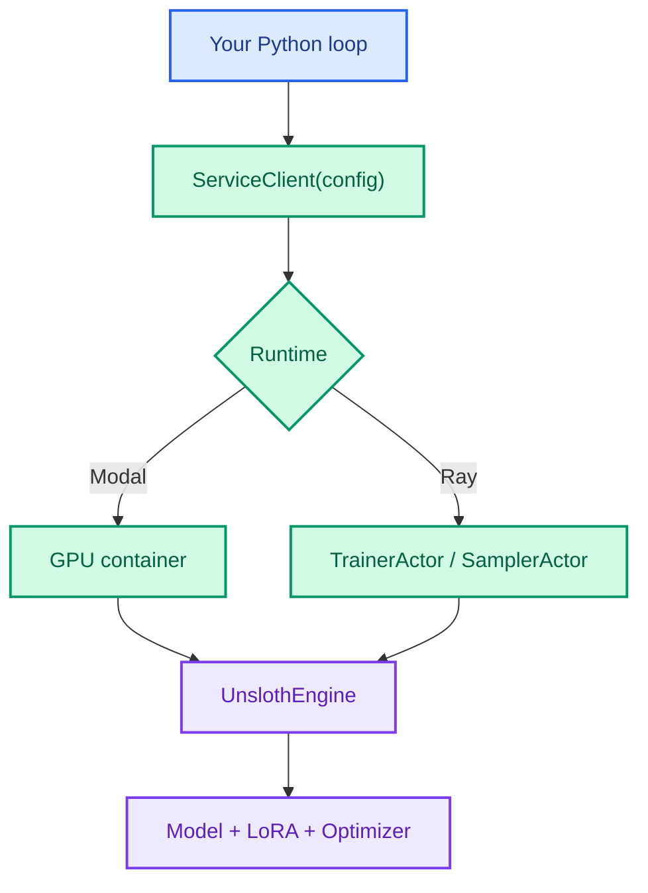

Documentation

<h1 class="doc-hero__title">ray-unsloth</h1>

  Run Tinker-shaped fine-tuning primitives on infrastructure you control. Write the training loop in Python, orchestrate with Ray, train with Unsloth, and optionally offload GPUs to Modal — without the hosted Tinker service.

<ul class="doc-hero__stack">
  <li>Your Python loop</li>
  <li>Ray actors</li>
  <li>Unsloth + LoRA</li>
  <li>Modal GPUs (optional)</li>
</ul>

## Start here

<a class="doc-card" href="./quickstart">
  <strong>Quickstart</strong>
  Install, run your first SFT step, and pick an example workflow in under 10 minutes.
</a>

<a class="doc-card" href="./architecture">
  <strong>Architecture</strong>
  How ServiceClient, Ray/Modal sessions, and UnslothEngine fit together.
</a>

<a class="doc-card" href="./guides/sft">
  <strong>SFT guide</strong>
  Build supervised fine-tuning loops with cross-entropy and checkpointing.
</a>

<a class="doc-card" href="./guides/rl">
  <strong>RL guide</strong>
  Sample rollouts, compute advantages, and update with policy-gradient losses.
</a>

<a class="doc-card" href="./configuration">
  <strong>Configuration</strong>
  YAML runtime configs for local Ray, Modal L4/A100, sharding, and multi-tenant runs.
</a>

<a class="doc-card" href="./compare-tinker">
  <strong>Tinker API compatibility</strong>
  What is implemented, partial, or still to build compared to the public Tinker SDK.
</a>

## What you get

`ray-unsloth` is a **primitive layer**, not a full trainer framework. You keep control of datasets, evaluation, and experiment logic. The package provides the same low-level surface researchers expect from Tinker:

- **`ServiceClient`** — create training and sampling clients from YAML config
- **`TrainingClient`** — `forward`, `forward_backward`, `optim_step`, checkpoint save/load
- **`SamplingClient`** — generation, logprobs, tokenizer access
- **`import tinker`** — compatibility alias for adapting cookbook examples

**Best for:** custom SFT/RL loops, Ray GPU placement, Modal-backed runs from a laptop, and Tinker-compatible prototyping without hosted lock-in.

## Core flow

Typical SFT: create client → build `Datum` objects → `forward_backward("cross_entropy")` → `optim_step` → save weights → `sample`.

Typical RL: sample rollouts → grade → build advantages → `forward_backward("importance_sampling" | "ppo" | "cispo")` → `optim_step`.

See the [SFT](./guides/sft.md) and [RL](./guides/rl.md) guides for full walkthroughs.

## Repository map

| Path | Purpose |
| --- | --- |
| `src/ray_unsloth` | Clients, types, config, runtimes, checkpoints, Unsloth engine |
| `src/tinker` | Compatibility alias and type shims for Tinker-style imports |
| `configs` | Runtime configs for L4, A100, sharding, multi-tenant, long-context |
| `examples` | SFT, RL, math RL, RULER 64k, overfit smoke, multi-tenant |
| `tests` | Unit tests for clients, types, engine, distributed orchestration |

## Headline capabilities

- Tinker-shaped clients with local future wrappers (`.result()`, async aliases)
- LoRA via Unsloth — 4-bit load, configurable target modules, RS-LoRA
- SFT with `cross_entropy`; RL with `importance_sampling`, `ppo`, `cispo`, and custom losses
- Live-policy sampling, multi-replica samplers, and atomic checkpoint manifests
- Ray placement groups, optional Modal GPU backend, single-node DDP sharding
- Multi-tenant examples — concurrent LoRA sessions on a shared GPU pool

**Not included:** hosted control-plane features (auth, billing, remote session management), Tinker Cookbook pipeline abstractions, or a built-in dataset/eval framework. See [Tinker API compatibility](./compare-tinker.md) for the full matrix.

